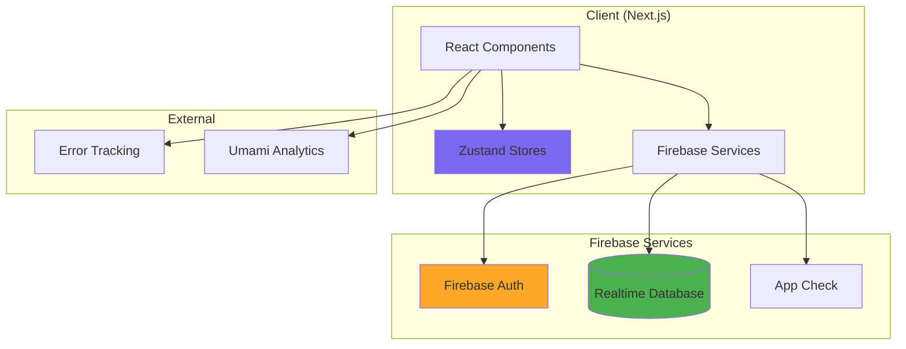
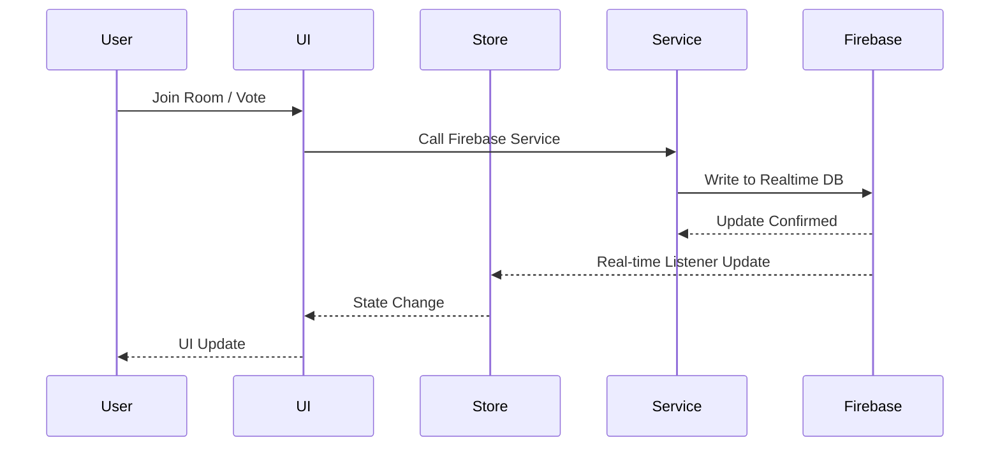

# spoker

A real-time planning poker (scrum poker) application for agile teams to estimate story points collaboratively.


[](https://sonarcloud.io/dashboard?id=sozonome_spoker) [](https://sonarcloud.io/dashboard?id=sozonome_spoker) [](https://sonarcloud.io/dashboard?id=sozonome_spoker) [](https://sonarcloud.io/dashboard?id=sozonome_spoker) [](https://sonarcloud.io/dashboard?id=sozonome_spoker) [](https://sonarcloud.io/dashboard?id=sozonome_spoker) [](https://sonarcloud.io/dashboard?id=sozonome_spoker) [](https://sonarcloud.io/dashboard?id=sozonome_spoker) [](https://sonarcloud.io/dashboard?id=sozonome_spoker)

[](http://commitizen.github.io/cz-cli/)

[](https://deepwiki.com/agustinusnathaniel/spoker)

## Overview

Spoker enables distributed teams to conduct planning poker sessions in real-time. Team members join rooms, vote on story points, and see results synchronized across all participants. The application uses Firebase Realtime Database for instant updates and supports multiple user roles with different permissions.

### What It Does

- **Real-time collaboration**: Multiple users can join rooms and vote simultaneously with live updates
- **Role-based access**: Three roles (owner, participant, observant) with different capabilities
- **Task management**: Queue-based workflow with completed task history
- **Vote hiding**: Configurable emoji-based labels to hide votes until all participants vote
- **Room privacy**: Support for public and password-protected private rooms
- **Email verification**: Required authentication with email verification

### What It Does Not Do

- Persistent user profiles or voting history across sessions
- Integration with project management tools (Jira, Trello, etc.)
- Analytics or reporting beyond basic vote averages
- Mobile native applications (web-only)
- Offline mode or local-first synchronization

## Architecture

### High-Level System Architecture



### Core Data Flow



### Repository Structure

```
spoker/
├── src/
│   ├── lib/                    # Core application logic
│   │   ├── components/         # Reusable UI components
│   │   ├── constants/          # Configuration constants
│   │   │   ├── routes/         # Route definitions (public/private/restricted)
│   │   │   └── hide-label.ts   # Vote hiding emoji options
│   │   ├── hooks/              # Custom React hooks
│   │   ├── layout/             # Layout components (header, footer, auth)
│   │   ├── models/             # Form validation schemas (Zod)
│   │   ├── pages/              # Page-level components
│   │   │   ├── hall/           # Room creation/joining interface
│   │   │   ├── room/           # Main voting interface
│   │   │   └── home/           # Landing page
│   │   ├── services/           # Firebase service layer
│   │   │   └── firebase/
│   │   │       ├── auth/       # Authentication operations
│   │   │       ├── room/       # Room CRUD and updates
│   │   │       └── rules.ts    # Security rules generator
│   │   ├── stores/             # Zustand state management
│   │   ├── styles/             # Theme configuration (Chakra UI)
│   │   ├── types/              # TypeScript type definitions
│   │   └── utils/              # Utility functions
│   └── pages/                  # Next.js pages (routing)
├── public/                     # Static assets
├── tools/                      # Build-time scripts
└── config files               # Next.js, TypeScript, Biome, etc.
```

## Tech Stack

### Core Dependencies

| Package | Purpose | Version |
|---------|---------|---------|
| `next` | React framework with SSR/SSG | ^16.1.1 |
| `react` | UI library | ^19.2.3 |
| `firebase` | Backend (Auth + Realtime Database) | ^12.7.0 |
| `@chakra-ui/react` | Component library | ^2.10.9 |
| `zustand` | State management | ^5.0.9 |
| `zod` | Runtime type validation | ^4.2.1 |
| `react-hook-form` | Form handling | ^7.69.0 |

### Development Tools

- **Biome**: Linting and formatting (replaces ESLint/Prettier)
- **TypeScript**: Type safety
- **Commitlint**: Conventional commits
- **Husky**: Git hooks
- **Knip**: Unused code detection
- **Sentry**: Error tracking and monitoring

## Getting Started

### Prerequisites

- Node.js v24.11.x (specified in `engines`)
- pnpm v10.24.0 (specified in `packageManager`)
- Firebase project with Realtime Database enabled
- ReCAPTCHA v3 site key (optional, for App Check)

### Environment Variables

Create a `.env.local` file with the following variables:

```bash
# Firebase Configuration
NEXT_PUBLIC_FIREBASE_API_KEY=
NEXT_PUBLIC_FIREBASE_AUTH_DOMAIN=
NEXT_PUBLIC_FIREBASE_DATABASE_URL=
NEXT_PUBLIC_FIREBASE_PROJECT_ID=
NEXT_PUBLIC_FIREBASE_STORAGE_BUCKET=
NEXT_PUBLIC_FIREBASE_MESSAGING_SENDER_ID=
NEXT_PUBLIC_FIREBASE_APP_ID=
NEXT_PUBLIC_FIREBASE_MEASUREMENT_ID=

# Optional: ReCAPTCHA for App Check
NEXT_PUBLIC_RECAPTCHA_SITE_KEY=

# Optional: Sentry
SENTRY_DSN=
NEXT_PUBLIC_SENTRY_DSN=
APP_ENV=
```

### Installation

```bash
# Install dependencies
pnpm install

# Run development server
pnpm dev
```

Open [http://localhost:3000](http://localhost:3000) to view the application.

### Building

```bash
# Type check
pnpm type:check

# Lint and format
pnpm biome:check
pnpm biome:fix

# Build for production
pnpm build

# Start production server
pnpm start
```

### Firebase Setup

1. Create a Firebase project in the [Firebase Console](https://console.firebase.google.com/)
2. Enable Realtime Database (not Firestore)
3. Configure Authentication (Email/Password and Google providers)
4. Deploy security rules using `pnpm generate-rules` (generates rules from `src/lib/services/firebase/rules.ts`)
5. Optionally enable App Check with ReCAPTCHA v3

## Development Workflows

### Code Quality

```bash
# Run all checks (linting, type checking)
pnpm check:turbo

# Check for unused code
pnpm check:unused
```

### Commits

This project uses [Conventional Commits](https://www.conventionalcommits.org/). Use `pnpm commit` (via Commitizen) or follow the format:

```
type(scope): subject

body (optional)

footer (optional)
```

### Release Process

```bash
# Create release (updates version, CHANGELOG.md)
pnpm release

# Push release tags
pnpm push-release
```

## Key Concepts

### User Roles

- **Owner**: Can create rooms, finish votes, configure room settings, manage tasks
- **Participant**: Can vote on tasks, view results when revealed
- **Observant**: Can view votes and results but cannot vote

### Room Lifecycle

1. **Creation**: Owner creates room with name, privacy, and optional password
2. **Joining**: Users join with a role (owner/participant/observant)
3. **Voting**: Participants vote on current task; votes hidden until all vote
4. **Reveal**: When all participants vote, results are shown to all
5. **Completion**: Owner selects final estimate and moves to next task in queue

### Vote Hiding

Votes can be hidden using emoji labels (monkey, chicken, cow, fish, money, cloud, shrimp, think) until all participants have voted. This prevents bias in estimation.

### Task Queue

- **Current Task**: Active task being estimated (`room.task`)
- **Queue**: Upcoming tasks (`room.queue[]`)
- **Completed**: Finished tasks with estimates (`room.completed[]`)

## Common Development Tasks

### Adding a New Page

1. Create component in `src/lib/pages/[page-name]/index.tsx`
2. Create route in `src/pages/[page-name].ts` (or `[page-name]/[id].ts` for dynamic routes)
3. Add route to appropriate constant in `src/lib/constants/routes/`

### Adding a New Firebase Service

1. Create service function in `src/lib/services/firebase/[domain]/[operation]/index.ts`
2. Export from service module
3. Update Firebase rules in `src/lib/services/firebase/rules.ts` if needed
4. Run `pnpm generate-rules` to regenerate rules JSON

### Modifying State Management

- Room state: `src/lib/stores/room.ts`
- Auth state: `src/lib/stores/auth.ts`
- Use `useShallow` from Zustand to prevent unnecessary re-renders

## Testing

Currently, the project does not include automated tests. Manual testing should cover:

- Room creation and joining
- Real-time vote synchronization
- Role-based permissions
- Task queue management
- Email verification flow
- Private room password protection

## Deployment

The project is configured for Vercel deployment (`vercel.json`). Ensure environment variables are set in the deployment platform.

## Contributors ✨

Thanks goes to these wonderful people ([emoji key](https://allcontributors.org/docs/en/emoji-key)):

<!-- ALL-CONTRIBUTORS-LIST:START - Do not remove or modify this section -->
<!-- prettier-ignore-start -->
<!-- markdownlint-disable -->
<table>
  <tbody>
    <tr>
      <td align="center" valign="top" width="14.28%"><a href="https://agustinusnathaniel.com/"><br /><sub><b>Agustinus Nathaniel</b></sub></a><br /><a href="https://github.com/agustinusnathaniel/spoker/commits?author=agustinusnathaniel" title="Code">💻</a> <a href="https://github.com/agustinusnathaniel/spoker/issues?q=author%3Aagustinusnathaniel" title="Bug reports">🐛</a> <a href="#design-agustinusnathaniel" title="Design">🎨</a> <a href="#ideas-agustinusnathaniel" title="Ideas, Planning, & Feedback">🤔</a> <a href="#infra-agustinusnathaniel" title="Infrastructure (Hosting, Build-Tools, etc)">🚇</a> <a href="#maintenance-agustinusnathaniel" title="Maintenance">🚧</a></td>
    </tr>
  </tbody>
</table>

<!-- markdownlint-restore -->
<!-- prettier-ignore-end -->

<!-- ALL-CONTRIBUTORS-LIST:END -->

This project follows the [all-contributors](https://github.com/all-contributors/all-contributors) specification. Contributions of any kind welcome!

## Related Documentation

- [CONTRIBUTING.md](./CONTRIBUTING.md) - Contribution guidelines
- [SPEC.md](./SPEC.md) - System specification and invariants
- [AGENTS.md](./AGENTS.md) - AI agent guidance and mental model
