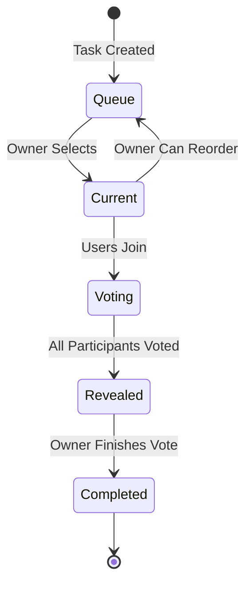
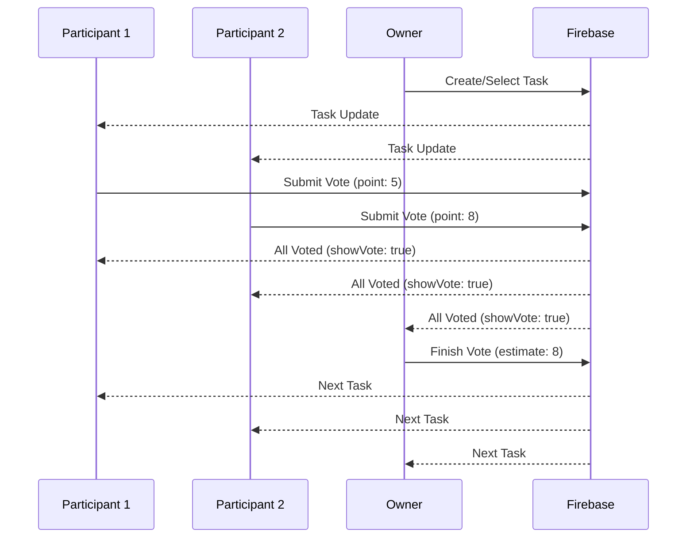

# System Specification

This document defines the system-level specification, core concepts, invariants, and constraints for spoker.

## Problem Statement

Spoker solves the problem of distributed agile teams needing a real-time, collaborative tool for planning poker (scrum poker) estimation sessions. It enables team members to vote on story points simultaneously, see results synchronized across all participants, and manage task queues without requiring external project management tool integrations.

## Core Concepts

### Room

A room is a collaborative space where users estimate tasks. Each room has:

- **Unique identifier**: Room ID (user-provided or generated)
- **Metadata**: Name, privacy setting (public/private), optional password
- **Configuration**: Vote hiding behavior, freeze-after-vote setting
- **State**: Current task, task queue, completed tasks, connected users

### User Roles

Three distinct roles with different capabilities:

| Role | Can Vote | Can Reveal Votes | Can Configure | Can Finish Vote | Can Manage Tasks |
|------|----------|------------------|---------------|-----------------|------------------|
| Owner | ✅ | ✅ | ✅ | ✅ | ✅ |
| Participant | ✅ | ❌ | ❌ | ❌ | ❌ |
| Observant | ❌ | ✅ | ✅ (hide label only) | ❌ | ❌ |

### Task Lifecycle



### Voting Flow



## System Invariants

### Data Integrity

1. **Room existence**: A room must exist in Firebase before users can join
2. **User presence**: Users must be in `room.users` to access room features
3. **Task consistency**: Only one task can be `room.task` at a time
4. **Vote validity**: Points must be in range [-1, 101] (per Firebase rules)
5. **Role immutability**: User role cannot be changed after joining (must rejoin)

### Business Logic

1. **Vote reveal condition**: Votes are revealed when:
   - All participants (not owners) have voted (`point >= 0`)
   - At least one participant exists
   - Not all users are owners

2. **Freeze after vote**: When `config.isFreezeAfterVote === true`, users cannot change votes after reveal

3. **Task progression**: When owner finishes vote:
   - Current task moves to `completed[]` with estimate
   - First task in `queue[]` becomes new `room.task`
   - If queue is empty, placeholder task is created
   - All user points are cleared

4. **Connection state**: Users are marked `isConnected: false` on disconnect; can rejoin to restore connection

### Security Invariants

1. **Authentication**: All room operations require authenticated user
2. **Authorization**: Users can only update their own user data (`users/$userID`)
3. **Room access**: Private rooms require password verification (client-side)
4. **Email verification**: Users must verify email before accessing private routes
5. **Firebase rules**: All writes validated by Firebase Realtime Database security rules

## Expected Behaviors

### Room Creation

- **Input**: Room name, privacy flag, optional password, room ID
- **Validation**: Room ID must be unique (checked before creation)
- **Output**: Room created in Firebase with:
  - Default task: `{ id: nanoid(21), name: '#1 Task', description: 'Edit Me' }`
  - Empty queue and completed arrays
  - Default config: `{ isFreezeAfterVote: true, hideLabel: 'monkey' }`
- **Error**: Throws if room ID already exists

### Joining a Room

- **Input**: Room ID, user role
- **Behavior**:
  - If user exists in room: Update role and connection status
  - If new user: Create user entry with role and connection status
  - If role changes to observant/owner: Clear existing vote
- **Output**: User added/updated in `room.users[$uid]`
- **Side effects**: Redirects to `/join/[id]` if user not in room

### Voting

- **Input**: Point value (from `pointOptions`: '0', '0.5', '1', '2', '3', '5', '8')
- **Constraints**:
  - Only participants and owners can vote
  - Cannot vote if `isFreezeAfterVote && showVote === true`
- **Behavior**:
  - Updates `room.users[$uid].point`
  - Updates `room.task.lastVoted` with user name and timestamp
- **Real-time**: All users see vote updates immediately

### Vote Reveal

- **Trigger**: Automatic when `checkAllParticipantVoted()` returns `true`
- **State change**: `showVote` transitions from `false` to `true`
- **Visibility**: All users see all votes and average point
- **Calculation**: Average computed from participant votes only (excludes observants)

### Finishing a Vote

- **Input**: Final estimate (selected by owner)
- **Prerequisites**: `showVote === true` and user is owner
- **Operations** (atomic sequence):
  1. Move current task to `completed[]` with estimate and point entries
  2. Set `room.task` to first item in `queue[]` (or placeholder if empty)
  3. Remove first item from `queue[]`
  4. Clear all user points (`point: null` or remove field)
  5. Reset `showVote` to `false`
- **Error handling**: If any operation fails, entire sequence should rollback (currently not implemented)

### Task Management

- **Queue operations**: Add, remove, edit, reorder tasks in `queue[]`
- **Current task**: Edit name and description of `room.task`
- **Selection**: Owner can set `selectedTaskIndex` to switch current task
- **Constraints**: Only owner can modify tasks

## Constraints and Limitations

### Technical Constraints

1. **Firebase Realtime Database**: 
   - No native transactions for multi-path updates
   - Write operations are eventually consistent
   - Maximum depth: 32 levels
   - Maximum data size per write: 256 MB

2. **Client-side only**: 
   - No server-side validation (relies on Firebase rules)
   - Password verification happens client-side (not secure for sensitive data)
   - No rate limiting or abuse prevention

3. **Real-time synchronization**:
   - Network latency affects update visibility
   - No conflict resolution for concurrent edits
   - Last write wins for most operations

### Business Constraints

1. **No persistence**: Rooms and data persist only in Firebase; no local backup
2. **No history**: User voting history not tracked across sessions
3. **No analytics**: Basic average calculation only; no statistical analysis
4. **Limited roles**: Fixed three-role system; no custom roles
5. **Point scale**: Fixed Fibonacci-like scale; not configurable per room

## Non-Goals

The following are explicitly **not** goals of this system:

1. **Project management integration**: No Jira, Trello, or other tool integrations
2. **User profiles**: No persistent user accounts with history or preferences
3. **Offline support**: Requires active internet connection
4. **Mobile apps**: Web-only; no native iOS/Android applications
5. **Advanced analytics**: No reporting, charts, or historical trends
6. **Multi-room management**: Users cannot manage multiple rooms simultaneously
7. **Team/organization features**: No team workspaces or shared room libraries
8. **Export functionality**: No data export (CSV, JSON, etc.)

## Known Limitations and Edge Cases

### Race Conditions

- **Concurrent votes**: Multiple users voting simultaneously may cause temporary inconsistencies
- **Task updates**: Owner finishing vote while participants are voting may cause confusion
- **Role changes**: User changing role mid-session may lose vote state

### Network Issues

- **Disconnections**: Users marked `isConnected: false` but can rejoin
- **Slow connections**: Vote reveals may appear delayed for some users
- **Offline mode**: No offline functionality; requires active connection

### Data Consistency

- **Orphaned users**: Users may remain in `room.users` if they disconnect without cleanup
- **Stale tasks**: Tasks in queue may become outdated if room is inactive
- **Duplicate rooms**: No prevention of duplicate room IDs across different Firebase projects

### Security Limitations

- **Password storage**: Private room passwords stored in plain text in Firebase
- **Client-side auth**: Email verification and password checks happen client-side
- **No rate limiting**: Firebase rules don't prevent rapid-fire writes

## Trade-offs

### Real-time vs. Consistency

**Choice**: Prioritize real-time updates over strong consistency
**Rationale**: Planning poker requires immediate feedback; eventual consistency is acceptable
**Impact**: Temporary inconsistencies possible during concurrent updates

### Client-side vs. Server-side

**Choice**: Client-side heavy application with Firebase as backend
**Rationale**: Simpler architecture, faster development, lower operational cost
**Impact**: Less control over business logic, security relies on Firebase rules

### Simplicity vs. Features

**Choice**: Focus on core voting functionality over advanced features
**Rationale**: Keeps codebase maintainable and focused on primary use case
**Impact**: Missing features like analytics, integrations, and advanced task management

## Data Model

### Room Structure

```typescript
interface RoomInstance {
  room: {
    name: string;
    isPrivate: boolean;
    password?: string;
  };
  task: Task;
  queue?: Array<Task>;
  completed?: Array<Task>;
  selectedTaskIndex: number;
  users?: {
    [uid: string]: User;
  };
  config: {
    isFreezeAfterVote: boolean;
    hideLabel?: 'monkey' | 'chicken' | 'cow' | 'fish' | 'money' | 'cloud' | 'shrimp' | 'think';
  };
}
```

### User Structure

```typescript
interface User {
  name: string;
  role: 'owner' | 'participant' | 'observant';
  point?: number;  // -1 to 101, or null/undefined
  isConnected: boolean;
}
```

### Task Structure

```typescript
interface Task {
  id: string;
  name: string;
  description?: string;
  estimation?: number;  // Final estimate after vote completion
  lastVoted?: {
    name: string;
    time: string;  // ISO timestamp
  } | null;
  pointEntries?: Array<{
    name: string;
    point: number;
  }>;
}
```

## API Surface

### Firebase Service Functions

#### Room Operations
- `createRoom(roomInstance)`: Create new room
- `getRoom(roomId)`: Fetch room data
- `joinRoom(roomId, role)`: Join room with role
- `rejoinRoom(roomId, role)`: Rejoin after disconnect

#### Vote Operations
- `updatePoint({ roomId, uid, point })`: Submit or update vote
- `clearPoints(roomId)`: Clear all user points
- `submitVote({ roomId, task, entries, estimate, queue, completed })`: Finish vote and move to next task

#### Task Operations
- `updateRoomTask(roomId, task)`: Update current task
- `rewriteQueue(roomId, queue)`: Replace entire queue
- `rewriteCompleted(roomId, completed)`: Replace completed array
- Queue operations: `addToQueue`, `removeFromQueue`, `editQueueItem`, `swapQueueItems`

#### Configuration
- `updateConfig(roomId, config)`: Update room configuration
- `disconnectUser(roomId, uid)`: Mark user as disconnected

### Store Hooks

#### Room Store
- `useRoomStoreState()`: Read room state (isBusy, showVote, roomData, users, inRoom)
- `useRoomStoreAction()`: Room state setters

#### Auth Store
- `useAuthStoreState()`: Read auth state (currentUser, displayName)
- `useAuthStoreAction()`: Auth state setters

## Performance Considerations

### Firebase Optimization

- **Shallow reads**: Read only necessary paths when possible
- **Listener cleanup**: Unsubscribe listeners in `useEffect` cleanup
- **Batch writes**: Group related writes (currently not implemented; could improve finish vote operation)

### React Optimization

- **Zustand shallow**: Use `useShallow` to prevent unnecessary re-renders
- **Memoization**: Use `React.useMemo` for expensive computations (e.g., vote averages)
- **Component splitting**: Separate concerns (vote UI, task list, controls)

### Real-time Updates

- **Debouncing**: Not currently implemented; could reduce Firebase write frequency
- **Optimistic updates**: UI updates immediately; Firebase confirms asynchronously

## Future Considerations

While not current goals, these areas may be considered for future development:

1. **Transaction support**: Implement client-side transaction simulation for atomic multi-path updates
2. **Conflict resolution**: Add merge strategies for concurrent edits
3. **Offline queue**: Queue operations when offline, sync when reconnected
4. **Room templates**: Pre-configured rooms with common point scales
5. **Export functionality**: Export completed tasks to CSV/JSON
6. **Room archiving**: Archive old rooms instead of permanent deletion

